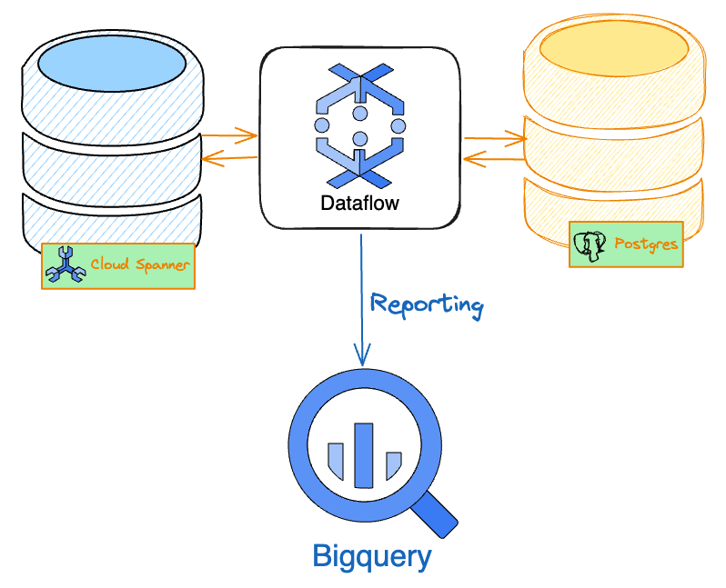

# Spanner Data Validator

This repo contains sample implementations of data validation for Spanner databases using Apache Beam. Since [Spanner](https://cloud.google.com/spanner) is a horizontally scalable database that can scale pretty much without limit, we need a framework for data validation that can handle this scale. [Apache Beam](https://beam.apache.org/) provides just such a scalable framework. It supports multiple languages - Java, Python, Go, etc..., but we use Java in this repo. While you can run Apache Beam applications locally on your machine or individual instances in the cloud, in order to realize the full power of the framework and scale across *multiple* instances, you have to run your application/job on a service like Dataflow. I describe how to do this in the section titled [Running validation using Dataflow](#running-validation-using-dataflow) below.

Having said all of the above, I should mention that you don't have to know much about Apache Beam or Dataflow or be a Java developer to use this tool. Simply follow the guidance below to get your own validation against Spanner up and running! You can jump to the [Installation](#installation) section and pick up from there if you'd prefer to skip the following section on the design of the tool.

## Design

First, here's a high level architecture diagram of how our data validator will work:

We use Apache Beam running on Dataflow to perform our data validation at scale and then send the reports to BigQuery. The reporting itself is pretty straightforward. Here's a sample report:

The above sample report provides a window into the design of this data validator. Let's start with the notion of partitioning.

### Partitioning

Partitioning is key to performing data validation at scale.

## Prerequisites

1. Access to a GCP account
2. Access to Spanner (Since you'll be performing validation against Spanner :))
3. Access to BigQuery
4. Access to Dataflow

## Installation

Please refer to the [installation instructions](Installation.md) to get started.

## Running validation from your local machine

NOTE: need connectivity

## Running validation using Dataflow

As alluded to above, Dataflow is a fully managed and scalable service for running Apache Beam applications on GCP. And once again, don't worry if you're new to Dataflow - simply follow the steps below to get your own validation job up and running.

1. 

## Supported configurations

1. JDBC <=> Spanner (MySQL and PostgreSQL)
2. Spanner <=> Spanner